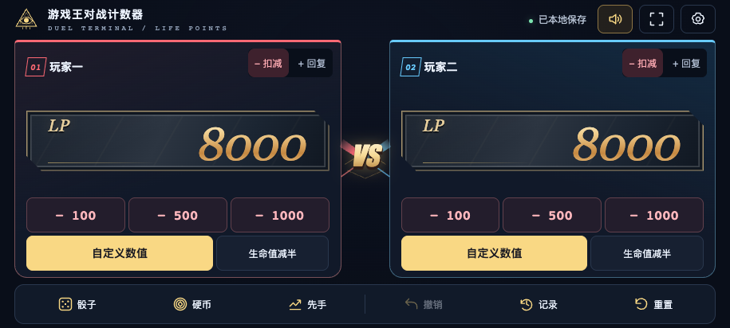

# 游戏王对战计数器

手机横屏使用的本地 HTML 决斗辅助工具。页面、样式、脚本和音效内嵌在单个文件中，可离线运行。

## 功能

- 双方生命值同屏显示，支持快捷扣减、回复、自定义数值和生命值减半。
- 骰子、硬币和先手判定，带操作动画。
- 生命值变化、结束及归零音效，可在主页面切换。
- 对战操作记录、撤销和重置；浏览器支持时自动保存本地状态。

## 使用

1. 下载 `outputs/游戏王对战计数器.html`。
2. 将文件发送到手机，用支持本地 HTML 的浏览器打开。
3. 横屏使用。文件预览器可能不执行脚本；本地保存行为取决于浏览器。

## 文件

- `outputs/`：正式网页、音频素材、界面预览及闲鱼封面。
- `work/`：封面可编辑源文件、截图辅助代码和音效参考素材。

## 界面预览

## 闲鱼封面

